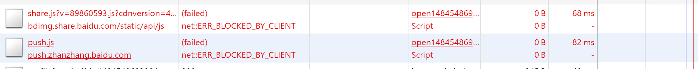
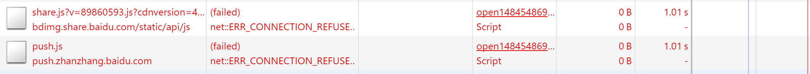
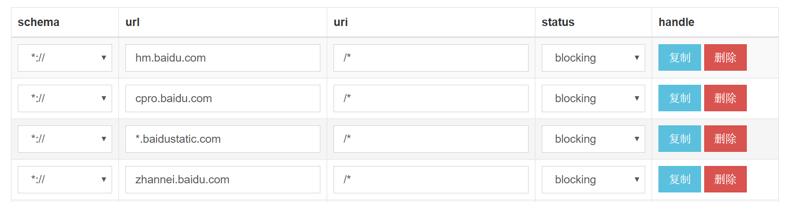
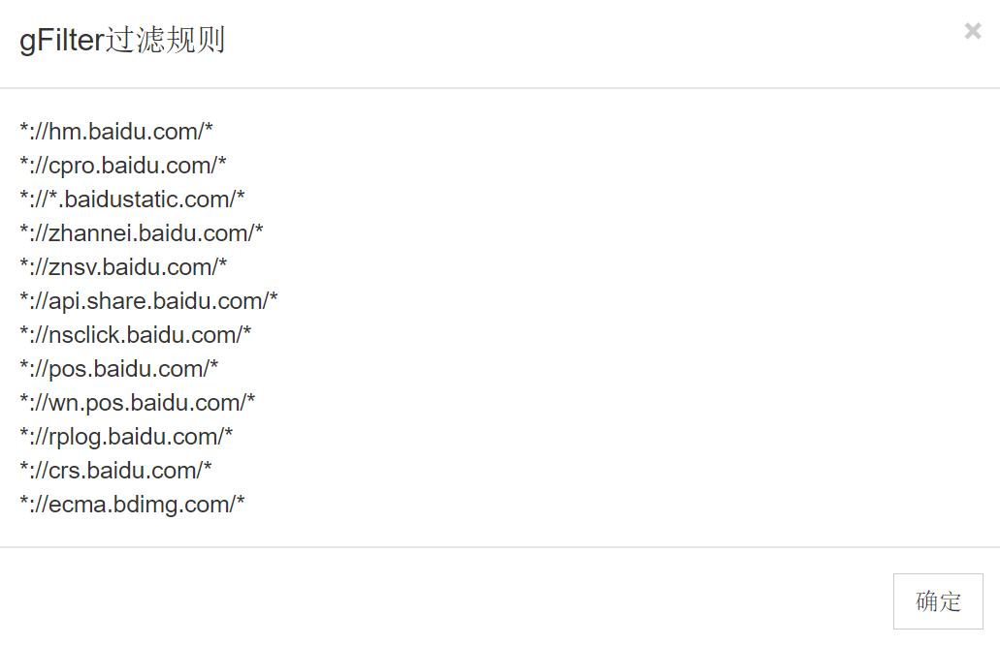

# Chrome扩展-gFilter

author: general

email: generals.space@gmail.com

lisence: MIT

[github地址](https://github.com/generals-space/gFilter)

## 1. gFilter作用

`gFilter`可以直接屏蔽网站内嵌的百度推广, 百度推荐, 谷歌数据统计的请求代码, 各种统计平台, 广告平台, 分享平台的数据链接, 缩短网站响应时间, 提高加载速率, 屏蔽多数广告. 

如下示例, gFilter屏蔽了`bdimg.share.baidu.com`与`push.zhanzhang.baidu.com`链接.



要达到同样的效果, 通过`hosts`文件进行网站屏蔽速度要慢太多. 下面是通过`hosts`文件屏蔽的结果, 可以看到, hosts文件屏蔽花得时间是以秒为单位的, 如果是页面的关键代码, 将会导致网站加载十分缓慢.




而且`hosts`规则添加起来比较麻烦(主要是打开文件比较麻烦, 尤其是在windows下), 方式也不灵活, 只能将整个站点都屏蔽. gFilter可以通过chrome提供的接口使用通配符的格式屏蔽指定链接, 如下:

```
*://image.wangchao.net.cn/middle/baitai/*
*://td.xue163.com/ajs/newjs/*
```

## 2. 使用方法

右键gFilter扩展图标 -> 选项, 打开gFilter配置页面, 将你要屏蔽的链接规则填写到如下表格中, 点击保存即可.



gFilter提供`导入/导出`功能, 所需格式相同, 如下


